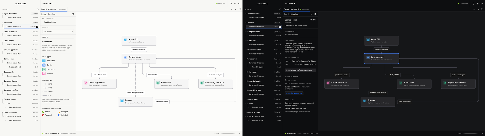

# Operator canvas shell reference

Approved 2026-08-30 as the visual direction for Archboard's application shell.
The image is a design reference, not a screenshot of current behavior and not a
pixel specification.

This supersedes the neutral and brass clean-room mockup adopted by TASK-111 as
the visual source of truth. TASK-111's shipped behavior remains product
contract and must survive the visual migration.

## Who this improves

The reference is for a person and an agent working on the same architecture
board for a sustained session. The shell should make the current board, pane,
selection, code binding, and agent claim easy to inspect without competing with
the canvas.

Archboard’s shell is desktop-only. Do not plan, implement, or gate phone/narrow
responsive layouts unless the user explicitly reverses this decision.

## Visual direction to preserve

- Use the compact lowercase `archboard` wordmark without an icon tile.
- Keep the canvas as the largest region. Chrome is flat, dense, and aligned to
  a strict grid.
- Give light and dark modes the same structure and hierarchy. Light mode uses
  chalk white, pale stone, near-black text, cobalt selection, and an acid-lime
  status accent. Dark mode uses deep charcoal, black panels, bone-white text,
  and the same two accents.
- Prefer one-pixel rules, small corner radii, and little or no shadow. Do not
  introduce gradients, glow, or rounded dashboard cards.
- Pair a neutral sans serif with monospaced secondary text for identifiers,
  paths, versions, and timing.
- Use a compact board strip on the left, one sidebar beside each pane's picture
  for the board and the selection (see [The pane sidebar](#the-pane-sidebar)),
  and a collapsible agent workbench below the canvas. Each region must earn the
  space it takes.

## Product mapping

The current product already has light and dark themes, board and variant
navigation, pane identity, live claim state, agent activity, and a way for the
person to take back control. Adoption should move these contracts into the new
composition rather than replace them.

The reference introduces three product additions worth building:

- A shell inspector for the selected element and its persisted code binding.
- A bottom workbench that presents real connection, claim, and `doing` data.
- A non-persistent focus mode for the architecture path connected to the
  selected element.
- A lazy navigator preview that depicts the real current board scene without
  opening, claiming, or changing that board.

## Illustrative details, not requirements

Several details were invented by image generation and do not describe product
state:

- The board-level Git branch indicator is out of scope. A board does not own a
  repository branch.
- Health, latency, and error-rate values are out of scope. Archboard has no
  telemetry source for them.
- The proposed dependency diff is out of scope. Agent edits stay visible on the
  live board rather than accumulating behind a preview.
- `Pause`, `Send`, and a prompt input are out of scope until Archboard owns a
  safe thread-control contract. The existing action is `Take back control`.
- Illustrative or synthetic board miniatures are out of scope. A navigator
  preview must depict real current board content and remain supplemental to
  accessible board identity and state.
- The drawing toolbar remains Excalidraw's responsibility. The mockup's tool
  rail communicates density and placement, not a second drawing toolset.

## The pane sidebar

Revised 2026-09-17 (TASK-249). The generated reference above places selection
details in a column on the right of the canvas; that column is superseded. A
semantic pane now has one sidebar on the left of its picture, the width of the
old inspector (`SIDEBAR_WIDTH`, 280 px), with two tabs:

- **Board**: how the board on screen is read — its views, the walkthroughs it
  offers, group inspection, and, a level down, the states of that board — and
  the legend for what is drawn. Choosing a walkthrough presents it (see below). The pane's own board offers no choice of state:
  the navigator lists every state of every board, and one choice is made in one
  place. Views live here rather than in a switcher on the picture, because this
  is the one home for "how is this board being read" and a switcher over the
  picture would cover what it switches.
- **Selection**: the inspector for whatever is picked out, with the control that
  lets go of the selection in the tab row.

Picking something out opens the selection tab; letting go gives back the tab
that was open before. The sidebar keeps its width whichever tab is open, so a
pick never changes the size of the pane or moves the picture. Collapsing it to
its tab icons gives the width to the picture, which refits to it until the
person has panned or zoomed. A pane presented fullscreen shows the picture
without its sidebar. There is no strip above the picture.

A presented walkthrough (TASK-250) is the picture and a caption laid over its
bottom edge, with the sidebar stepped aside: the step's heading in the
`presentation` type role, its words under it, where it is in the walkthrough, the
steps, and previous and next. The camera keeps the step's subjects clear of the
caption, glides between steps, and what a step is not about recedes. Escape
leaves.

The image is a rendered capture of the dogfood vault at 1920×1080, not a
generated mockup: the board tab in the light theme on the left, the selection
tab in the dark theme on the right.

## Typography and wordmark contract

The generated reference PNG has no authoritative embedded font metadata. The
font choice is therefore a reproducible visual match, not a claim that the
reference's original font was identified. The audit compared tightly cropped
raster geometry at several antialiasing thresholds, then checked the selected
faces in the real shell at the supported 1920×1080 desktop viewport.

The exact reference rectangles below use `(x, y, width, height)` in the tracked
1672×941 PNG:

- light wordmark `(13, 13, 99, 28)`; dark wordmark `(849, 13, 99, 28)`
- human header text `(140, 7, 548, 40)`
- navigator labels `(10, 90, 104, 168)`
- inspector secondary text `(660, 101, 167, 108)`
- workbench text `(220, 700, 346, 126)`

The same-size wordmark comparison produced normalized intersection-over-union
scores of Inter 600 `.813`, Inter Tight 600 `.801`, Geist 600 `.806`, Manrope
700 `.847`, and Onest 700 `.844`. Manrope's small numerical lead came with the
sharper terminals visible in `a`, `r`, and `d`; Onest retained the reference's
softer counters. The final Onest Medium pass at an 18.5px equivalent and
`-0.375px` tracking measured 85×13 pixels. Across thresholds 128/160/180 its
mean IoU was `.785` and mean absolute ink delta was `5.06%`; at threshold 160
the values were `.808` and `-1.1%`. Current Inter 800 was 28.7% too dense in
the original pass. The derived candidate grids, threshold overlays, and live
shell crops remain ephemeral audit evidence rather than tracked product assets.

The final generated path, consumed through the real CSS mask in headless
Chromium at 1440×900, retained an 84×13 hard-pixel box. Against the reference
crop, thresholds 128/160/180 produced ink deltas of `+5.2%`, `+2.6%`, and
`-3.9%`, with best-shift IoU `.747`, `.755`, and `.751`; every best shift was
`(0, 0)`. This is the implementation check, separate from the earlier browser
text-rendering audit.

The resulting application contract is:

- **Onest 1.000** for human interface text: 400 for body copy, 500 for labels
  and metadata, 600 for headings, and 700 for emphasis. Human headings and
  labels stay normal or title case with normal tracking.
- **DM Mono 1.000** only for technical tokens: 400 for values and timestamps,
  and 500 for compact technical emphasis such as the level badge. Repository
  names, paths, branches, commits, element IDs, and activity times are
  technical; state phrases, counts, navigator labels, inspector labels, and
  workbench prose are not.
- `font-synthesis: none` and bundled, uniquely named families prevent a
  machine-local face from silently substituting or synthesizing an unsupported
  weight. The inspector's completed TASK-140.06 grid and spacing remain its
  layout contract; this typography pass does not reopen that geometry.

The runtime Onest file is the variable TTF from Google Fonts commit
[`d0754ee`](https://github.com/google/fonts/blob/d0754ee7cddf8ba879f1f8884e3ca2b5e1b100f8/ofl/onest/Onest%5Bwght%5D.ttf),
which carries the audited 1.000 outlines and supplies exact 400/500/600/700
instances. The official [Onest 1.000 static
release](https://github.com/simpals/onest/releases/tag/1.000) omits SemiBold,
so the variable file is required for the 600 role. DM Mono Regular and Medium
come from upstream commit
[`57fadab`](https://github.com/googlefonts/dm-mono/tree/57fadabfb200a77de2812540026c249dc3013077/exports).
Both families use the SIL Open Font License 1.1. Exact binary, license, source,
and SHA-256 provenance is recorded beside the assets in
`src/ui/shell/assets/fonts/README.md`.

The canonical lowercase wordmark is one SVG path generated from the official
Onest 1.000 static Medium TTF with pair kerning and
`-0.02027027027em` tracking. `scripts/generate-wordmark.ts` pins and verifies
the source SHA, uses `opentype.js` 1.3.4, translates the optical outline bounds
to zero, and emits the byte-stable 85.7815×13.209 view box. The static source is
deliberate: that version of `opentype.js` reads a variable font's `fvar` table
but does not apply its `gvar` deltas when generating paths. The SVG contains
only safe metadata and the `currentColor` path—no text, image, script, event,
external reference, or runtime font dependency. The shell consumes it as a CSS
mask and gives the mark the accessible name `archboard`.

## Verification standard

Adoption is complete only when rendered browser checks cover both themes at the
supported desktop viewport, existing shell behavior remains reachable, and the
canvas receives the largest share of the available workspace. Any new
selection, focus, or preview presentation must not write to the board note.

## Provenance

- Generated with OpenAI's built-in image generation tool on 2026-08-30.
- SHA-256: `9d8521b3d608a9a4d5cddd75ce0e05f1630a5dbad76009ea4faf3859c51c6679`
- Use case: `ui-mockup`

Generation brief

> Design direction 3 for "archboard", a live architecture canvas
> collaboratively edited by a human and an AI agent. Show two complete desktop
> application screenshots side by side in one 16:9 image: the same bold
> operator-focused interface in high-contrast light mode on the left and dark
> mode on the right.
>
> Use a slim project strip, compact board and lock state in the top bar, a
> central architecture canvas, a narrow inspector, and a collapsible agent
> workbench along the bottom. The interface should use a confident Swiss grid,
> neutral grotesk type with monospaced secondary text, strong alignment, cobalt
> and acid-lime accents, crisp borders, and almost no shadow. Keep the canvas
> primary. Avoid gradients, cyberpunk styling, generic chat bubbles, oversized
> rounded cards, decorative 3D graphics, people, perspective, and device
> hardware.

