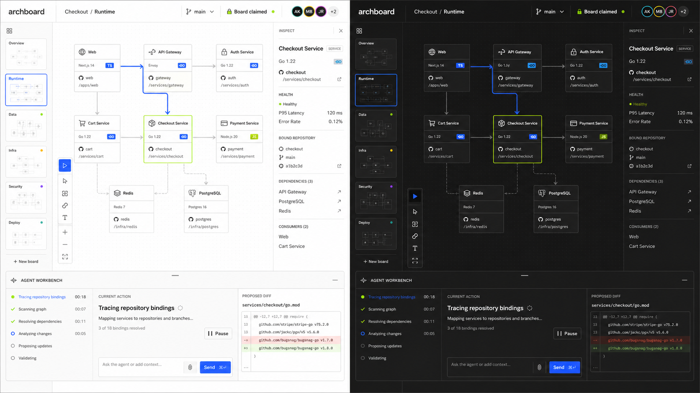

# Operator canvas shell reference

Approved 2026-08-30 as the visual direction for Archboard's application shell.
The image is a design reference, not a screenshot of current behavior and not a
pixel specification.

This supersedes the neutral and brass clean-room mockup adopted by TASK-111 as
the visual source of truth. TASK-111's shipped behavior remains product
contract and must survive the visual migration.

## Who this improves

The reference is for a person and an agent working on the same architecture
board for a sustained session. The shell should make the current board, pane,
selection, code binding, and agent claim easy to inspect without competing with
the canvas.

## Visual direction to preserve

- Use the compact lowercase `archboard` wordmark without an icon tile.
- Keep the canvas as the largest region. Chrome is flat, dense, and aligned to
  a strict grid.
- Give light and dark modes the same structure and hierarchy. Light mode uses
  chalk white, pale stone, near-black text, cobalt selection, and an acid-lime
  status accent. Dark mode uses deep charcoal, black panels, bone-white text,
  and the same two accents.
- Prefer one-pixel rules, small corner radii, and little or no shadow. Do not
  introduce gradients, glow, or rounded dashboard cards.
- Pair a neutral sans serif with monospaced secondary text for identifiers,
  paths, versions, and timing.
- Use a compact board strip on the left, selection details on the right, and a
  collapsible agent workbench below the canvas. Each region must earn the space
  it takes.

## Product mapping

The current product already has light and dark themes, board and variant
navigation, pane identity, live claim state, agent activity, and a way for the
person to take back control. Adoption should move these contracts into the new
composition rather than replace them.

The reference introduces three product additions worth building:

- A shell inspector for the selected element and its persisted code binding.
- A bottom workbench that presents real connection, claim, and `doing` data.
- A non-persistent focus mode for the architecture path connected to the
  selected element.

## Illustrative details, not requirements

Several details were invented by image generation and do not describe product
state:

- The board-level Git branch indicator is out of scope. A board does not own a
  repository branch.
- Health, latency, and error-rate values are out of scope. Archboard has no
  telemetry source for them.
- The proposed dependency diff is out of scope. Agent edits stay visible on the
  live board rather than accumulating behind a preview.
- `Pause`, `Send`, and a prompt input are out of scope until Archboard owns a
  safe thread-control contract. The existing action is `Take back control`.
- Board miniatures may remain compact identity tiles. This reference does not
  require generated previews.
- The drawing toolbar remains Excalidraw's responsibility. The mockup's tool
  rail communicates density and placement, not a second drawing toolset.

## Verification standard

Adoption is complete only when rendered browser checks cover both themes at a
desktop viewport and at 420 pixels, existing shell behavior remains reachable,
and the canvas receives the largest share of the available workspace. Any new
selection or focus presentation must remain browser-only view state and must
not write to the board note.

## Provenance

- Generated with OpenAI's built-in image generation tool on 2026-08-30.
- SHA-256: `9d8521b3d608a9a4d5cddd75ce0e05f1630a5dbad76009ea4faf3859c51c6679`
- Use case: `ui-mockup`

Generation brief

> Design direction 3 for "archboard", a live architecture canvas
> collaboratively edited by a human and an AI agent. Show two complete desktop
> application screenshots side by side in one 16:9 image: the same bold
> operator-focused interface in high-contrast light mode on the left and dark
> mode on the right.
>
> Use a slim project strip, compact board and lock state in the top bar, a
> central architecture canvas, a narrow inspector, and a collapsible agent
> workbench along the bottom. The interface should use a confident Swiss grid,
> neutral grotesk type with monospaced secondary text, strong alignment, cobalt
> and acid-lime accents, crisp borders, and almost no shadow. Keep the canvas
> primary. Avoid gradients, cyberpunk styling, generic chat bubbles, oversized
> rounded cards, decorative 3D graphics, people, perspective, and device
> hardware.

